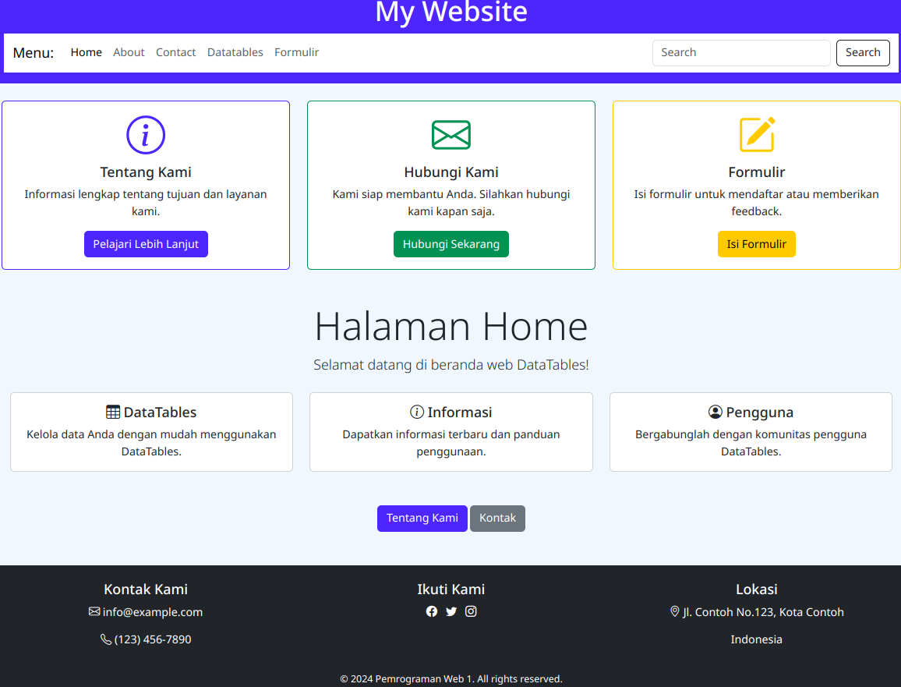
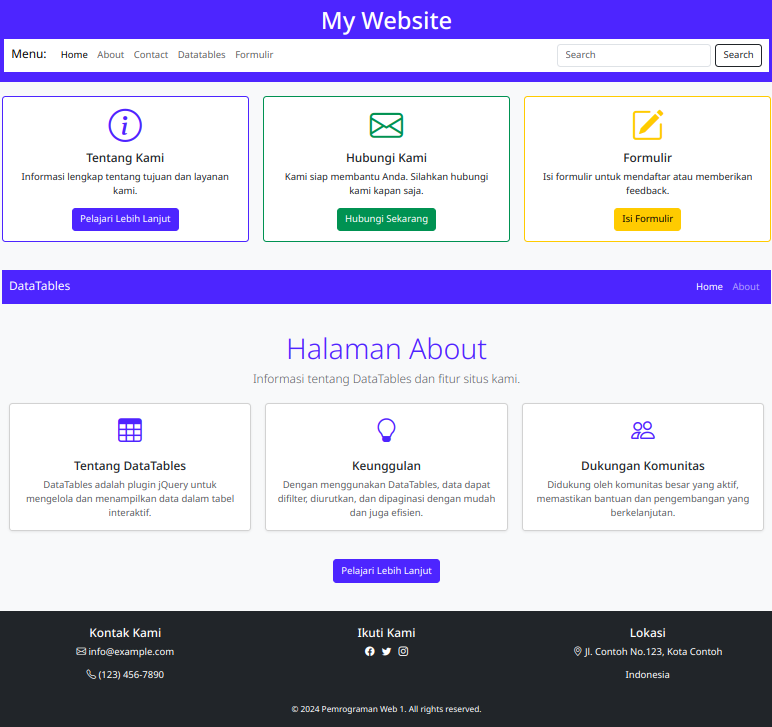
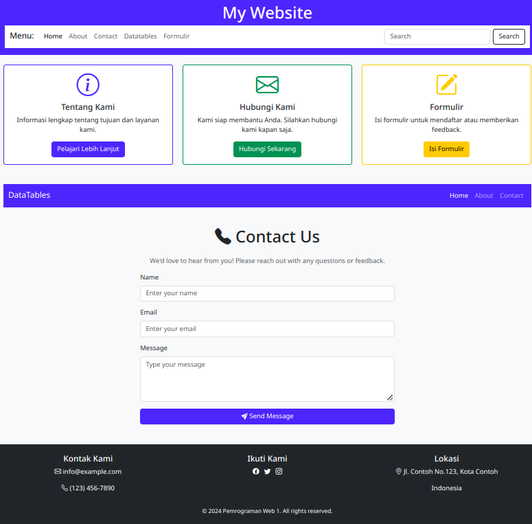
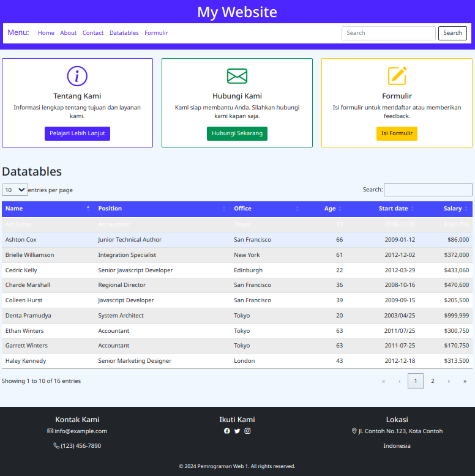
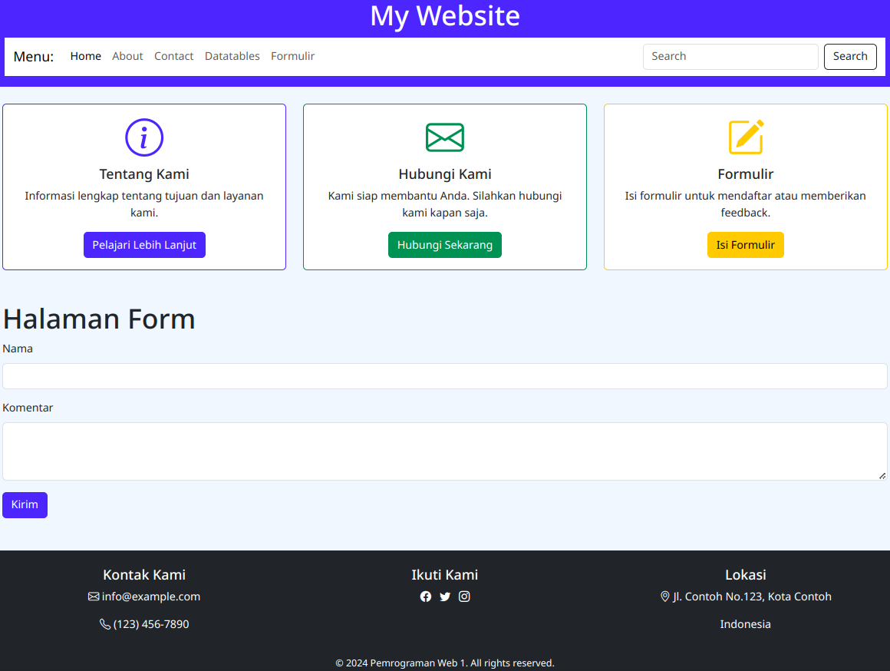

# UTS Web Dinamis

### Nama : Denta Pramudya
### NIM  : 312310464
### Kelas: TI.23.A5

**1. Halaman Utama / Home**

``
Ini merupakan halaman utama yang terdapat Navbar menu yang bisa di-klik, yaitu
Home, About, Contact, Datatables, dan Formulir.
Terdapat juga penjelasan Tentang Kami, Hubungi Kami, dan Formulir.
Pada bagian isi Halaman Home, terdapat inormasi mengenai datatables, dan lainnya.
Terdapat juga footer yang tertera, seperti Kontak, Sosial Media, dan Lokasi, dan pada
bagian bawah terdapat copyright.
``

**2. Bagian About**

``
Bagian ini terdiri dari penjelasan detail tentang isi website, seperti Tentang DataTables, Keunggulan, dan juga Dukungan Komunitas
``

**3. Bagian Contact**

``
Bagian ini berisi formulir yang digunakan untuk menghubungi pihak website,
terdapat Nama, Email, dan Message / Pesan.
``

**4. Bagian DataTables**

``
Bagian ini berisi banyak nama, position, office, age, start date, dan salary. Ini
memungkinkan untuk bisa melihat data yang banyak secara rapi dan tidak
berantakan.
``

**5. Bagian Form**

``
Pada bagian ini, terdapat Nama dan komentar yang dibuat untuk mengirim pesan ke Pemilik Website.
``